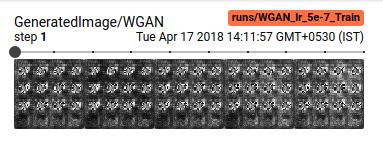
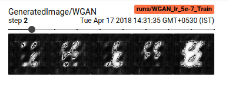
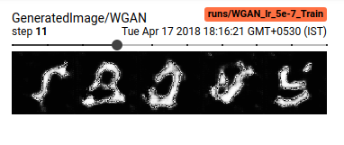
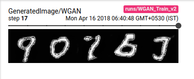
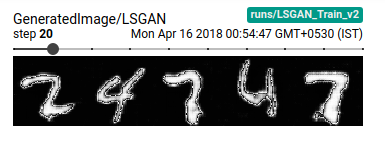
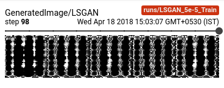
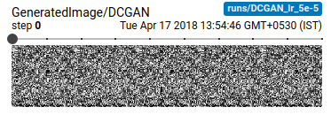
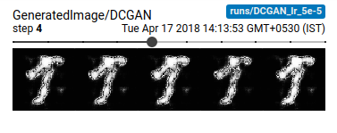

# Stability-of-GANs

The following repository contains Pytorch implemenations of Generative Adversarial Network Implementations. This project discusses effects of different GAN approaches at training.

# Types of GANs

[x]Deconvolutional GAN(DCGAN)
[x]Loss Sensitive GAN(LSGAN)
[x]Wassertein GAN(WGAN)
[x]Wassertein GAN with Gradient Penalty()
[ ]Energy GAN
[ ]Evolutionary GAN

# Training command
CUDA_VISIBLE_DEVICES=1 python main.py -type "WGAN" -epochs 100 -is_cuda True -lr 5e-6

## Conclusion and Results
* Even after multiple initialization,DCGAN tends to be more susceptible to problem of mode collapse.
* Choice of hyperparameters are really important.Lower learning rate is better than high. 
* I was not able to train WGAN when discriminator didn't use sigmoid,I am yet not aware of the reason for it. Theoretically,WGAN is not predicting probability and its only concerned with earth mover distance, so it shouldn't have been a problem
* Quick decrease in loss of generator loss, and increase in loss of discriminator is a sign of mode collapse.
* Keep saving your model regularly,at times, it seems that your model starts generating impressive results, after a tea break , you are left with garbage.
### Wassertein GAN(WGAN)

### LSGAN 

### DCGAN 

