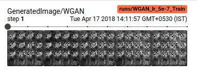
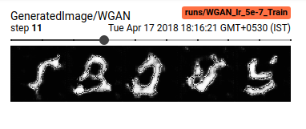
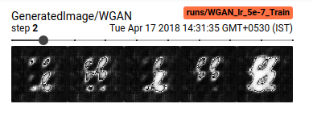
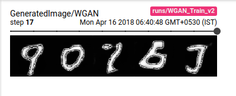
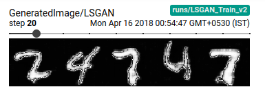
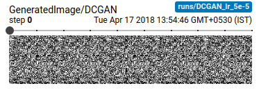
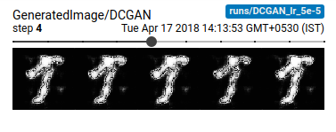

# Stability-of-GANs

The following repository contains Pytorch implemenations of Generative Adversarial Network Implementations. This project discusses effects of different GAN approaches at training.

* Types of GANs
[x]Deconvolutional GAN(DCGAN)
[x]Loss Sensitive GAN(LSGAN)
[x]Wassertein GAN(WGAN)
[x]Wassertein GAN with Gradient Penalty()
[ ]Energy GAN
[ ]Evolutionary GAN

# Training command
CUDA_VISIBLE_DEVICES=1 python main.py -type "WGAN" -epochs 100 -is_cuda True -lr 5e-6

## Results
### Wassertein GAN(WGAN)

### LSGAN 

### DCGAN 

